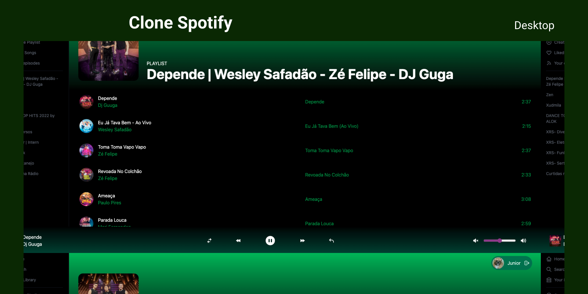

<p align="center">
  
</p>

<p align="center">
  
</p>

<h1 align="center">
    
</h1>

<br>

## 🧪 Tecnologias

Esse projeto foi desenvolvido com as seguintes tecnologias:

- [React](https://reactjs.org)
- [NextJS](https://nextjs.org/)
- [TailwindCSS](https://tailwindcss.com/)
- [Spotify API](https://developer.spotify.com/)

## 🚀 Como executar

Clone o projeto e acesse a pasta do mesmo.

```bash
$ git clone https://github.com/jrxr/clone_spotify.git
$ cd clone_spotify
```

Para iniciá-lo, siga os passos abaixo:
```bash
# Instalar as dependências
$ yarn
# Iniciar o projeto
$ yarn dev
```
O app estará disponível no seu browser pelo endereço http://localhost:3000.

Lembrando que será necessário criar uma conta no [Spotify](https://developer.spotify.com/) para ter acesso as listas de reprodução e controle da reprodução das músicas e para obter as credencias de autenticação. Em seguida, defina no arquivo .env as configurações do seu projeto (remova o example do arquivo .env.example).

## 💻 Projeto

Clone do Spotify foi realizado com intuito das pessoas ter sua lista de reprodução do Spotify e com controle de pausar, iniciar, diminuir e aumentar as músicas com a API do Spotify.

## 📝 License

Esse projeto está sob a licença MIT. Veja o arquivo [LICENSE](LICENSE.md) para mais detalhes.

---

Feito com 💜 by Agacy Júnior 💻